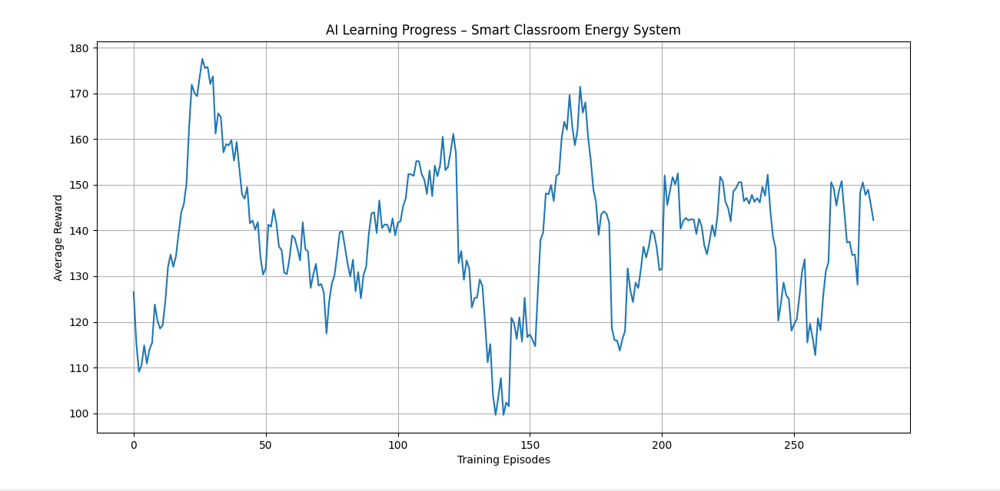

# Smart Classroom Energy Optimization using Reinforcement Learning

AI-powered system that automatically manages classroom devices (lights, AC, computers) to reduce energy waste while maintaining student comfort.
Overview

Classrooms often waste electricity because lights, air conditioners, and computers remain ON even when they are not required. This leads to unnecessary energy consumption and increased electricity costs.

This project proposes a Smart Classroom Energy Management System powered by Reinforcement Learning. The AI agent learns how to control classroom devices in order to maintain student comfort while minimizing energy consumption.

Problem Statement

In educational institutions, classroom devices are usually controlled manually. This often leads to situations where:

Lights remain ON in empty classrooms
Air conditioners run even when temperature is comfortable
Computers stay powered ON unnecessarily

These issues cause significant energy waste.

The goal of this project is to develop an AI-based system that automatically manages classroom devices based on environmental conditions and student presence.

Proposed Solution

We designed a custom Reinforcement Learning environment where an AI agent interacts with a simulated classroom.

The AI observes the current classroom conditions and decides actions such as turning devices ON or OFF.

Over multiple training episodes, the agent learns to make better energy-efficient decisions.

## Key Features

- Reinforcement Learning based decision-making
- Smart energy optimization for classrooms
- Considers student presence and temperature
- Time-of-day aware environment
- Energy consumption modeling
- AI learning visualization using training graphs

Environment State

The classroom environment is represented using the following variables:

Variable	Description
Students	Number of students in the classroom
Temperature	Current room temperature
Lights	Light status (ON/OFF)
AC	Air Conditioner status (ON/OFF)
Computers	Computer status (ON/OFF)
Time of Day	Morning / Afternoon / Evening

Example state:

[25, 33, 1, 0, 1, 2]

Meaning:

25 students present
Temperature = 33°C
Lights ON
AC OFF
Computers ON
Time = Evening
Actions

The AI agent can perform the following actions:

Action	Description
0	Toggle Lights
1	Toggle Air Conditioner
2	Toggle Computers
3	Do Nothing
Reward Mechanism

The AI agent learns through rewards and penalties.

Positive Rewards
Maintaining comfortable classroom temperature
Turning lights ON when students are present
Turning AC ON when temperature is high
Penalties
Lights ON when classroom is empty
AC ON when no students are present
High unnecessary energy consumption

This reward system encourages the AI to balance comfort and energy efficiency.

Energy Consumption Model

Each device consumes energy:

Device	Energy Cost
Lights	2 units
AC	5 units
Computers	3 units

The AI receives penalties when total energy usage becomes unnecessarily high.

AI Training

The AI agent is trained using Q-Learning, a reinforcement learning algorithm.

During training:

The agent observes the classroom state.
It selects an action.
The environment returns a reward.
The agent updates its decision strategy.

Over time, the agent learns optimal actions that maximize reward.

Training Result

## Training Result

The graph below shows how the AI agent improves its decision-making over multiple training episodes.

**Explanation:**
- The X-axis represents the number of training episodes.
- The Y-axis represents the reward obtained by the AI agent.
- Higher rewards indicate better decisions that balance **student comfort and energy efficiency**.

As training progresses, the reward trend improves, showing that the AI agent learns how to manage classroom devices more effectively.

Demo Simulation

The system includes a demo script that simulates classroom decision-making.

Run the demo using:

python demo.py

Example output:

Students: 25
Temperature: 33
Time: Afternoon

AI Decision: Turn AC ON
Reward: +10

This demonstrates how the AI agent observes the classroom environment and makes intelligent decisions.

Project Structure
smart-classroom-energy-ai
│
├── env.py
├── train.py
├── demo.py
├── requirements.txt
├── README.md
├── training_graph.png
Technologies Used
Python
Gymnasium
NumPy
Matplotlib
Reinforcement Learning (Q-Learning)
Future Improvements

Possible future extensions of this system include:

Integrating real IoT sensors for classroom monitoring
Expanding the system to manage energy across an entire campus
Using Deep Reinforcement Learning for more advanced decision making
Building a real-time smart building energy management system
Conclusion

This project demonstrates how Reinforcement Learning can be applied to create an intelligent system capable of optimizing energy consumption in classrooms while maintaining a comfortable learning environment.

Such AI-powered solutions can significantly reduce energy waste in educational institutions and contribute toward smarter and more sustainable campuses.
